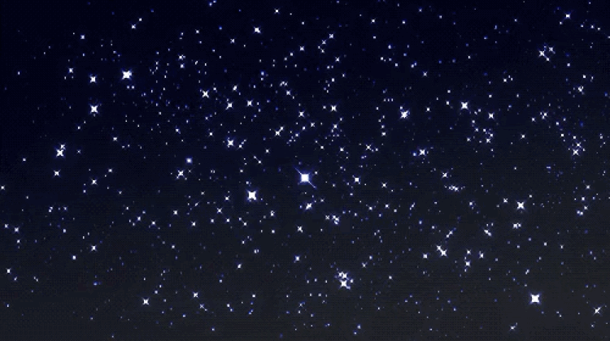

<!-- Profile README for MorningStarTech317 -->

<!-- Starry Banner -->

  

<!-- Name with Typing Effect -->

  

---

## ​ About Me
💡 **MorningStarTech317** — Innovating with precision, merging creativity and engineering.  
🚀 Full-stack developer driven by **web tech, AI, cloud, and automation**.  
🌌 Turning complexity into elegant, scalable solutions.

---

## ​ Expanded Skill Set
**Languages:** JavaScript • TypeScript • Python • Java • PHP • C# • C++ • SQL • HTML5 • CSS3 • SASS  
**Frameworks & Libraries:** React • Next.js • Node.js • Express • Angular • Vue.js • Django • Flask • Spring Boot • ASP.NET Core  
**Databases:** MySQL • PostgreSQL • MongoDB • SQLite • Redis • Firebase  
**DevOps & Tools:** Git • GitHub Actions • Docker • Kubernetes • Jenkins • Nginx • Apache • Postman • Figma  
**Cloud Platforms:** AWS (EC2, S3, Lambda) • GCP • Azure  
**Specialties:** API Development • AI & ML (OpenAI, TensorFlow, scikit-learn) • Web Security • Performance Optimization  

---

## ​ GitHub Stats

  
  

---

## ​ Contribution Graph

  

---

## ​ Featured Quote
> *"Bringer of light, compiler of code — guiding ideas from darkness into dawn."*

---

##  Connect with Me

  
  

---

✨ *From the morning star, with light and logic.* ✨

